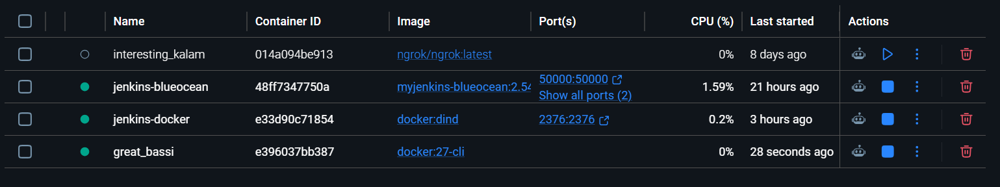
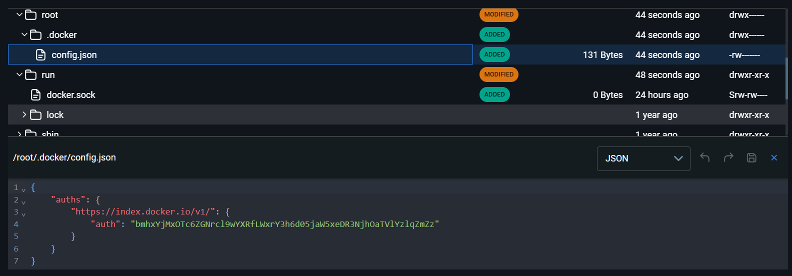
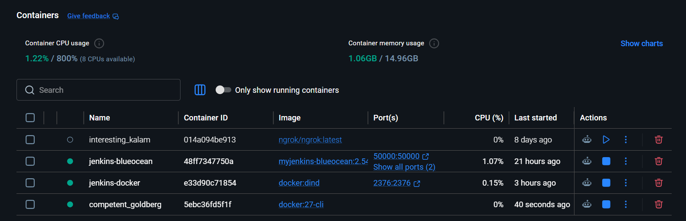
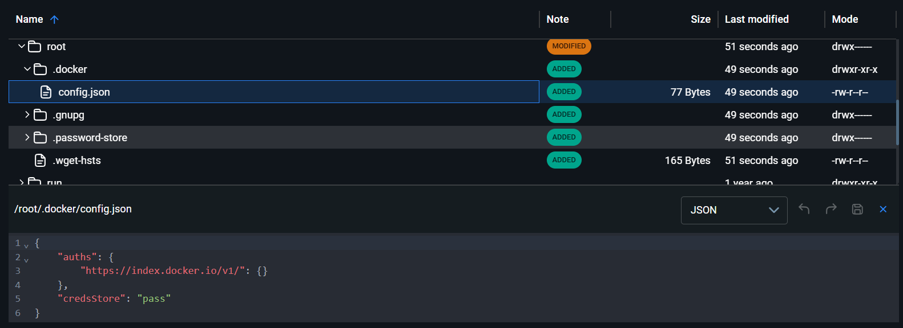
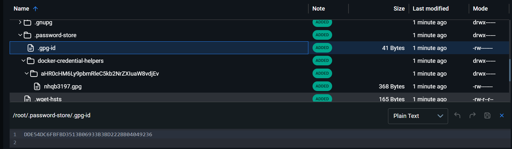
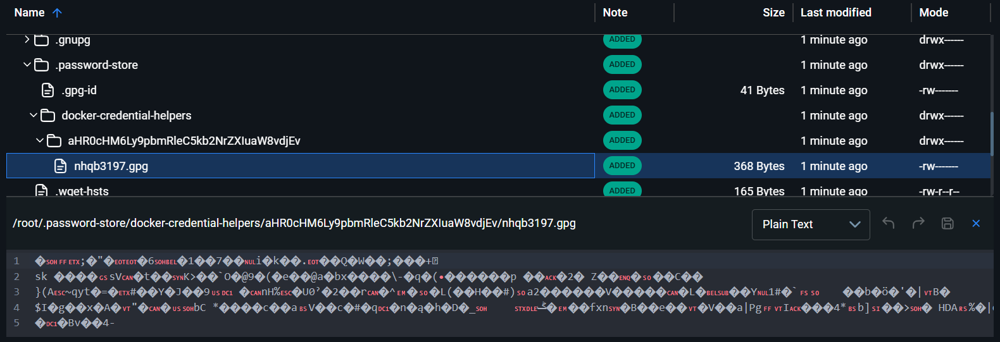

**THIS REPO USE FOR DEMO CONFIG JENKINS WITH CREDENTIALS HELPER - USING AGENT**

---

**Setup Jenkins Network + Docker in Docker**

```
# Create a Docker network for Jenkins and Docker-in-Docker
docker network create jenkins

docker run --name jenkins-docker --rm --detach `
  --privileged --network jenkins --network-alias docker `
  --env DOCKER_TLS_CERTDIR=/certs `
  --volume jenkins-docker-certs:/certs/client `
  --volume jenkins-data:/var/jenkins_home `
  --publish 2376:2376 `
  docker:dind
```

---

**Setup Jenkins without using credential helper**

* **Build Jenkins Image**

```
# --- # --- # --- # --- # --- # --- # --- # --- # Without credentials helper
# Build
docker build -t myjenkins-blueocean:2.541.3 .

# Run
docker run --name jenkins-blueocean --restart=on-failure --detach `
  --network jenkins --env DOCKER_HOST=tcp://docker:2376 `
  --env DOCKER_CERT_PATH=/certs/client --env DOCKER_TLS_VERIFY=1 `
  --volume jenkins-data:/var/jenkins_home `
  --volume jenkins-docker-certs:/certs/client:ro `
  --publish 8080:8080 --publish 50000:50000 myjenkins-blueocean:2.541.3
```

* **Setup Jenkins**

Access localhost:8080

Default init + installation

Add dockerhub credential

Create pipeline job

---

**Run first job**

* **Jenkinsfile**

For demo purpose, copy the code in Jenkinsfile -> paste in Pipelinescript in Jenkins

Save -> Exec the build

The result

```
Started by user admin
[Pipeline] Start of Pipeline
[Pipeline] node
Running on nhqb in C:\Users\MarcoNguyen\Documents\lab\workspace\workspace\nhqb-pipeline
[Pipeline] {
[Pipeline] withEnv
[Pipeline] {
[Pipeline] stage
[Pipeline] { (Test Docker Login CLI)
[Pipeline] withCredentials
Masking supported pattern matches of %DOCKERHUB_USERNAME% or %DOCKERHUB_PASSWORD%
[Pipeline] {
[Pipeline] script
[Pipeline] {
[Pipeline] isUnix
[Pipeline] bat
WARNING! Your password will be stored unencrypted in /root/.docker/config.json.
Configure a credential helper to remove this warning. See
https://docs.docker.com/engine/reference/commandline/login/#credential-stores

Login Succeeded
{
	"auths": {
		"https://index.docker.io/v1/": {
			"auth": "****c6****"
		}
	}
}
Removing login credentials for https://index.docker.io/v1/
[Pipeline] }
[Pipeline] // script
[Pipeline] }
[Pipeline] // withCredentials
[Pipeline] }
[Pipeline] // stage
[Pipeline] }
[Pipeline] // withEnv
[Pipeline] }
[Pipeline] // node
[Pipeline] End of Pipeline
Finished: SUCCESS
```

The WARNING is showing that the credentials is stored unencrypted in based 64 which can be easily decrypted.

In this demo, I use Jenkins agent to start a new container to run job



As above log in pipeline, the credential is stored in based 64 inside the container



---


* **Run another job with credential helper**

Use the script in Jenkinsfile.bat

Note: This demo is running on Windows -> using .bat

The result

```
Started by user admin
[Pipeline] Start of Pipeline
[Pipeline] node
Running on nhqb in C:\Users\MarcoNguyen\Documents\lab\workspace\workspace\nhqb-pipeline
[Pipeline] {
[Pipeline] withEnv
[Pipeline] {
[Pipeline] stage
[Pipeline] { (Test Docker Login CLI)
[Pipeline] withCredentials
Masking supported pattern matches of %DOCKERHUB_USERNAME% or %DOCKERHUB_PASSWORD%
[Pipeline] {
[Pipeline] bat
fetch https://dl-cdn.alpinelinux.org/alpine/v3.21/main/x86_64/APKINDEX.tar.gz
fetch https://dl-cdn.alpinelinux.org/alpine/v3.21/community/x86_64/APKINDEX.tar.gz
(1/33) Installing libgpg-error (1.51-r0)
(2/33) Installing libassuan (2.5.7-r0)
(3/33) Installing pinentry (1.3.1-r0)
Executing pinentry-1.3.1-r0.post-install
(4/33) Installing libgcrypt (1.10.3-r1)
(5/33) Installing gnupg-gpgconf (2.4.9-r0)
(6/33) Installing gmp (6.3.0-r2)
(7/33) Installing nettle (3.10.2-r0)
(8/33) Installing libffi (3.4.7-r0)
(9/33) Installing libtasn1 (4.21.0-r0)
(10/33) Installing p11-kit (0.25.5-r2)
(11/33) Installing gnutls (3.8.12-r0)
(12/33) Installing libksba (1.6.7-r0)
(13/33) Installing gdbm (1.24-r0)
(14/33) Installing libsasl (2.1.28-r8)
(15/33) Installing libldap (2.6.8-r0)
(16/33) Installing npth (1.6-r4)
(17/33) Installing gnupg-dirmngr (2.4.9-r0)
(18/33) Installing sqlite-libs (3.48.0-r4)
(19/33) Installing gnupg-keyboxd (2.4.9-r0)
(20/33) Installing libbz2 (1.0.8-r6)
(21/33) Installing gpg (2.4.9-r0)
(22/33) Installing gpg-agent (2.4.9-r0)
(23/33) Installing gpg-wks-server (2.4.9-r0)
(24/33) Installing gpgsm (2.4.9-r0)
(25/33) Installing gpgv (2.4.9-r0)
(26/33) Installing gnupg-utils (2.4.9-r0)
(27/33) Installing gnupg-wks-client (2.4.9-r0)
(28/33) Installing gnupg (2.4.9-r0)
(29/33) Installing readline (8.2.13-r0)
(30/33) Installing bash (5.2.37-r0)
Executing bash-5.2.37-r0.post-install
(31/33) Installing tree (2.2.1-r0)
(32/33) Installing pass (1.7.4-r3)
(33/33) Installing wget (1.25.0-r0)
Executing busybox-1.37.0-r12.trigger
OK: 38 MiB in 67 packages
gpg: keybox '/root/.gnupg/pubring.kbx' created
gpg: /root/.gnupg/trustdb.gpg: trustdb created
gpg: directory '/root/.gnupg/openpgp-revocs.d' created
gpg: revocation certificate stored as '/root/.gnupg/openpgp-revocs.d/31249E43D20BA01151D16CA28FD94D40D39CA299.rev'
gpg: checking the trustdb
gpg: marginals needed: 3  completes needed: 1  trust model: pgp
gpg: depth: 0  valid:   1  signed:   0  trust: 0-, 0q, 0n, 0m, 0f, 1u
created directory: '/root/.password-store/'
Password store initialized for 31249E43D20BA01151D16CA28FD94D40D39CA299
Login Succeeded
=== CONFIG ===
{
	"auths": {
		"https://index.docker.io/v1/": {}
	},
	"credsStore": "pass"
}
Removing login credentials for https://index.docker.io/v1/
[Pipeline] }
[Pipeline] // withCredentials
[Pipeline] }
[Pipeline] // stage
[Pipeline] }
[Pipeline] // withEnv
[Pipeline] }
[Pipeline] // node
[Pipeline] End of Pipeline
Finished: SUCCESS
```

Note that no WARNING is in the log. And in workspace of the container, the config.json is:





With this config, it stores credentials in a GPG-encrypted file. Same as demo-1, but using Jenkins agent with container to start a job.





---
