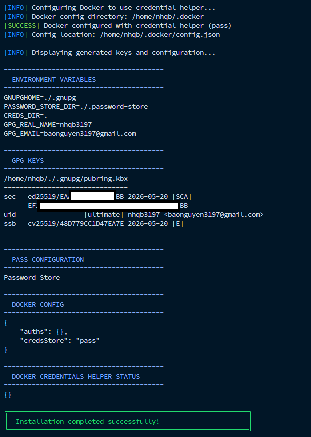
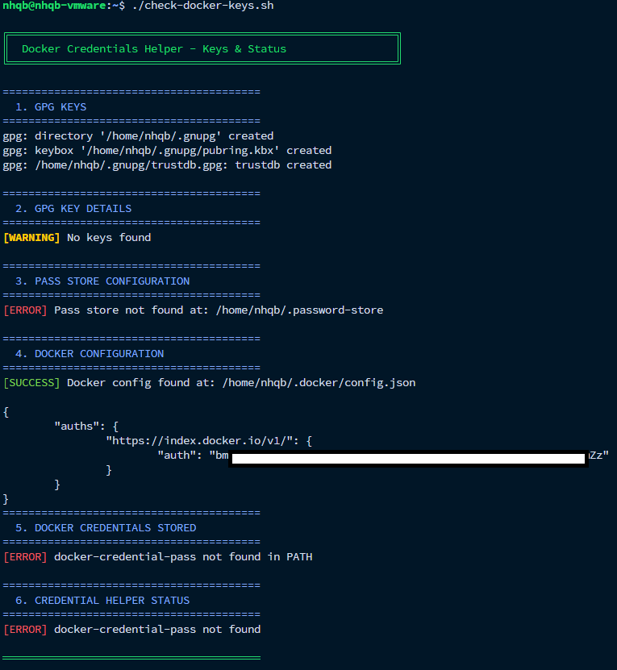
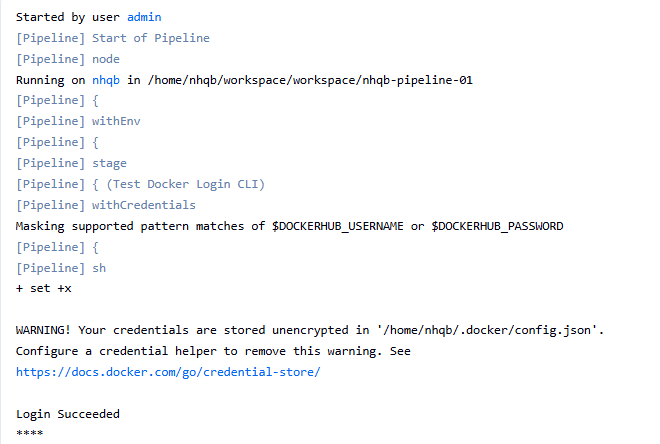
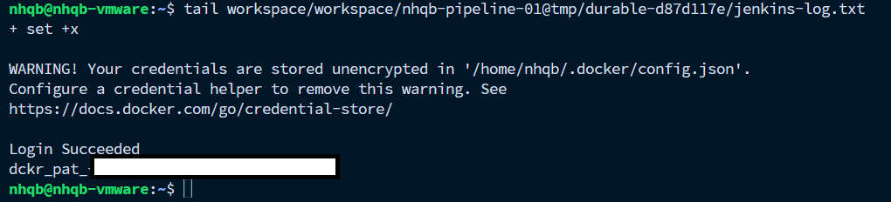
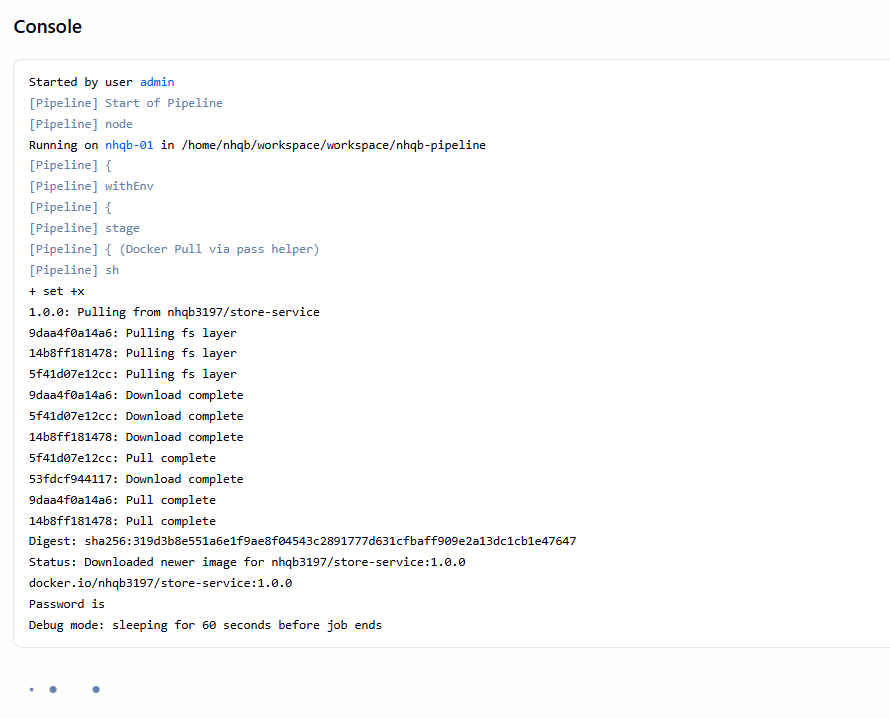
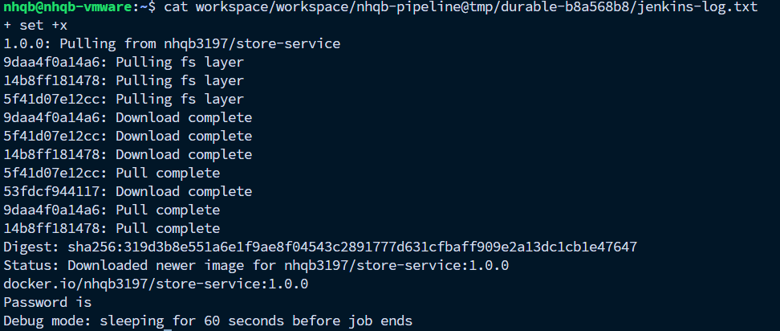

This guideline use for setting up docker-credentials-helper by using script

---

# Pre-check

> ***Note:***
>
> *This setup is run on a fresh new environment. You can skip this step if you have already run docker login in the agent.*

First, check that the environment has no credentials stored by executing the script *check-docker-keys.sh*

```
chmod +x check-docker-keys.sh
./check-docker-keys.sh
```


---

## First login

Let's login to Dockerhub & check for credentials store unsecured

```
docker login -u ${USERNAME}

# Follow the instruction to login to Dockerhub
```


Check the config

`cat .docker/config`


The credentials is stored in based64 & can be easily decrypted.

Or use the *check-docker-credentials.sh* to check for the keys

`./check-docker-keys.sh`


---

# Installation + Configuration

> ***Note:** *
>
> *Before executing the install-docker-credentials.sh, please read below arguments carefully.*

## Script arguments

Use `install-docker-credentials.sh` with flags.

### Flags

- `-u`, `--username` sets the GPG real name that will be used when generating the key.
- `-e`, `--email` sets the GPG email address attached to the key.
- `-d`, `--dir` sets the credentials directory where `.gnupg`, `.password-store`, and `.docker` will be created.
- `-h`, `--help` prints the built-in usage help and exits.

### Default values

- Username: `John Doe`
- Email: `john@example.com`
- Directory: current folder `.`

### Examples

```bash
# Use the default values
bash install-docker-credentials.sh

# Set a custom name and email
bash install-docker-credentials.sh -u john -e john@example.com

# Set a custom name, email, and credentials directory
bash install-docker-credentials.sh -u "John Doe" -e john@example.com -d /home/john
```

## Installation + Configuration

```
chmod +x install-docker-credentials.sh
./install-docker-credentials.sh
```




This script automatically install + config the gpg key

You can follow the manual config in README.md for better understanding the process

### Verify

You can verify the configuration after the script is executed by using the *check-docker-keys.sh*


Or check direclty in the current working dir


# Use Docker Credentials Helper

After above step, let's login to Dockerhub again to apply new change


### Verify


`cat .password-store/docker-credential-helpers/aH***Ev/nhqb3197.gpg`


You can see that the credentials is now encrypted

# Demo

In this demo, I start 2 agents, the first one which haven't been configured *docker-credentials-helper*.
The second one is installed + configured.

Both agents will pull private image from dockerhub that required authentication.

Prepare 2 agent nodes:

* nhqb - 192.168.233.134
* nhqb-01 - 192.168.233.128

## Agent nhqb

On this agent, execute the *check-docker-keys.sh* to verify the config


Then, start the job using the code in *Jenkinsfile.insecure*.

### Verify

```
# Jenkinsfile.insecure
# Note
# This pipeline for demo purpose as echo will print out the credentials in the pipeline runtime log

```



As shown in the UI, Jenkins masks the credentials; however, in the backend job log files, the password is still persisted in plain text



This approach is insecure and should use a credential helper, as recommended in the warning message

## Agent nhqb-01

This agent has already installed & configured by executing the *install-docker-credentials.sh*

Verify by using the *check-docker-keys.sh*


From now on, the Jenkins pipeline can run without requiring `withCredentials`, as the credentials are securely stored using the `credStore: pass` credential helper.

```
# This agent runs using the Jenkinsfile Groovy script.
# The script has removed the `withCredentials` block that previously injected the Docker Hub credentials into environment variables.
# The pipeline is still able to pull a private image from Docker Hub, which requires authentication.
# Although the pipeline defines the credentials in the environment configuration, the job itself does not use `withCredentials`,
# meaning the credentials are never exposed during the job runtime.
# The result is shown below.
```





It completely bypass the credentials during the jon runtime.

> ***Note:***
>
> * When using docker-credentials-helper does not required to logout, as the credential is kept in pass varialbe in .docker/config.json
> * The *docker logout* & *docker login* only use once when update the key value or add new key
