This guideline use for setting up docker-credentials-helper by using script

---

# Pre-check

***Note:** **This setup is run on a fresh new environment. You can skip this step if you have already run docker login in the agent.*

First, check that the environment has no credentials stored by executing the script *check-docker-keys.sh*

```
chmod +x check-docker-keys.sh
./check-docker-keys.sh
```

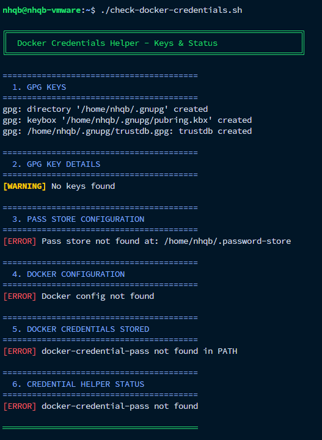

---

## First login

Let's login to Dockerhub & check for credentials store unsecured

```
docker login -u ${USERNAME}

# Follow the instruction to login to Dockerhub
```

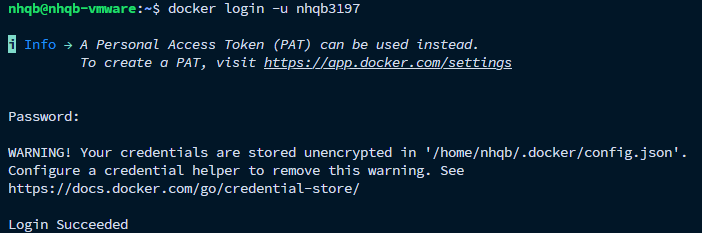

Check the config

`cat .docker/config`

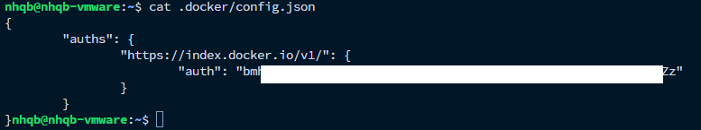

The credentials is stored in based64 & can be easily decrypted.

Or use the *check-docker-credentials.sh* to check for the keys

`./check-docker-keys.sh`

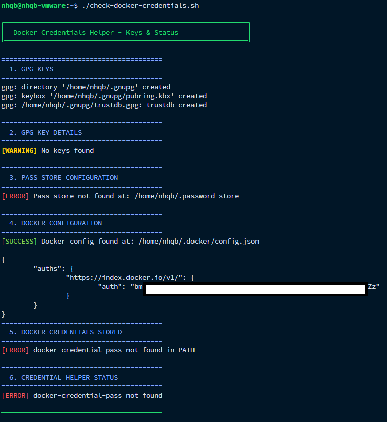

---

# Installation + Configuration

***Note: Before executing the install-docker-credentials.sh, please read below arguments carefully.***

## Script arguments

Use `install-docker-credentials.sh` with flags.

### Flags

- `-u`, `--username` sets the GPG real name that will be used when generating the key.
- `-e`, `--email` sets the GPG email address attached to the key.
- `-d`, `--dir` sets the credentials directory where `.gnupg`, `.password-store`, and `.docker` will be created.
- `-h`, `--help` prints the built-in usage help and exits.

### Default values

- Username: `John Doe`
- Email: `john@example.com`
- Directory: current folder `.`

### Examples

```bash
# Use the default values
bash install-docker-credentials.sh

# Set a custom name and email
bash install-docker-credentials.sh -u john -e john@example.com

# Set a custom name, email, and credentials directory
bash install-docker-credentials.sh -u "John Doe" -e john@example.com -d /home/john
```

## Installation + Configuration

```
chmod +x install-docker-credentials.sh
./install-docker-credentials.sh
```

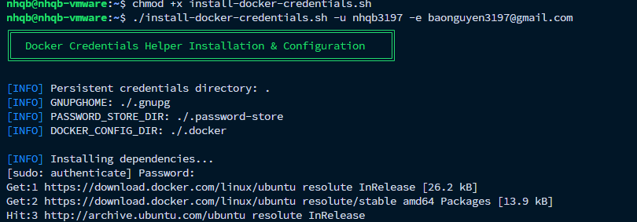

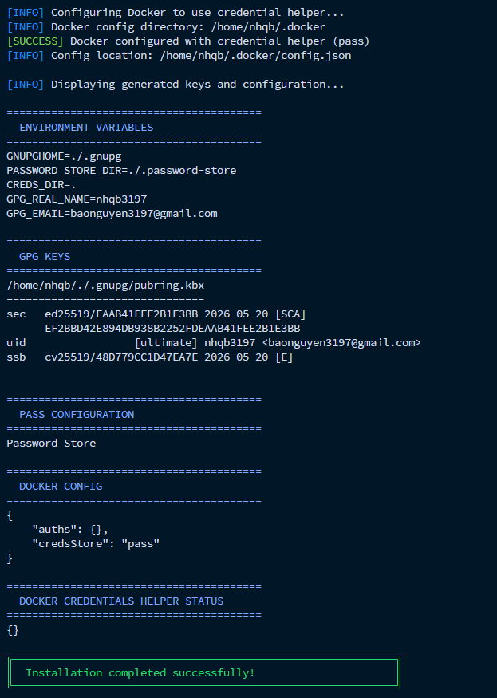

This script automatically install + config the gpg key

You can follow the manual config in README.md for better understanding the process

### Verify

You can verify the configuration after the script is executed by using the *check-docker-keys.sh*

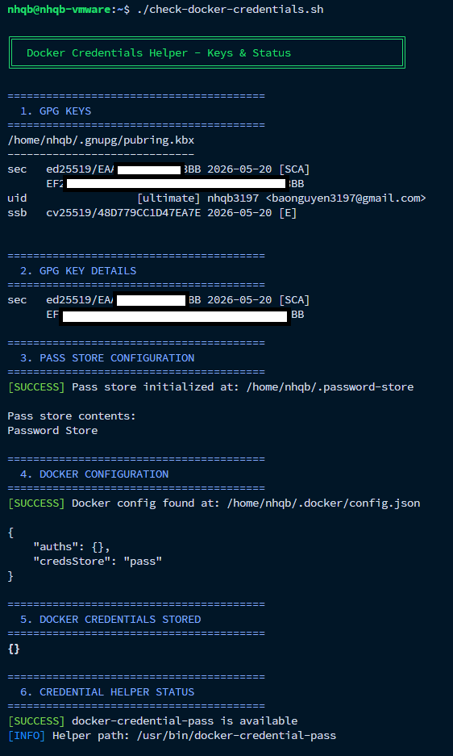

Or check direclty in the current working dir

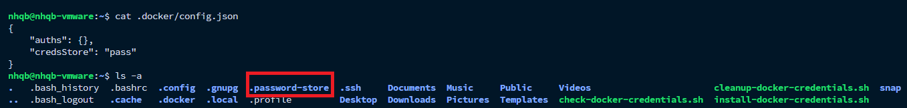

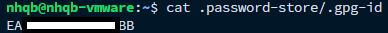

# Use Docker Credentials Helper

After above step, let's login to Dockerhub again to apply new change

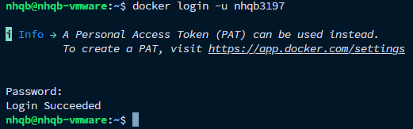

### Verify

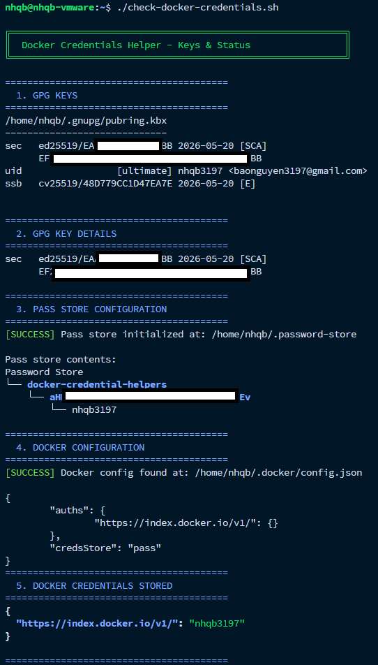

`cat .password-store/docker-credential-helpers/aH***Ev/nhqb3197.gpg`

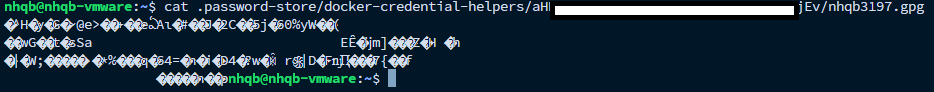

You can see that the credentials is now encrypted

# Jenkins Agent usage

From now on, the Jenkins pipeline now can run without adding the *withCredentails* in it, as it stores the credentials in runtime environment.

### Verify

```
# Jenkinsfile
# Note
# This pipeline for demo purpose as echo will print out the credentials in the pipeline runtime log


```
