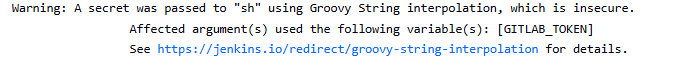
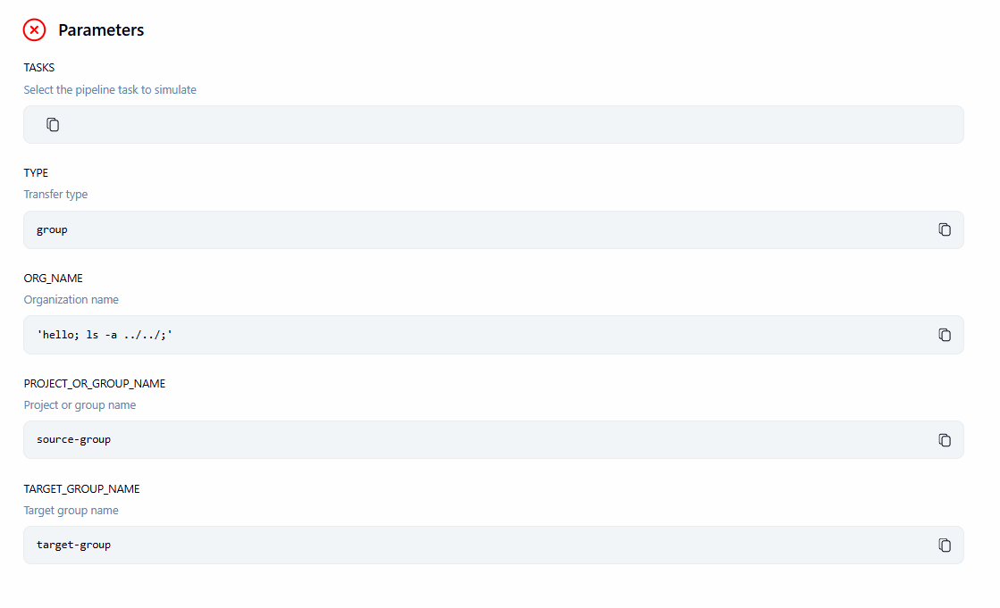
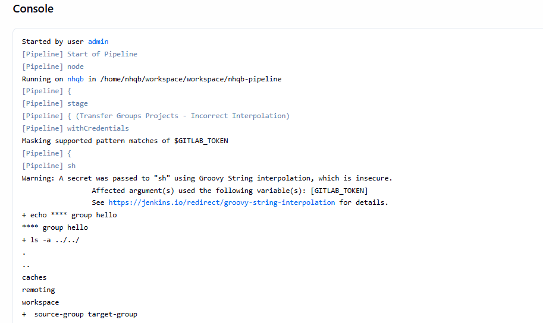
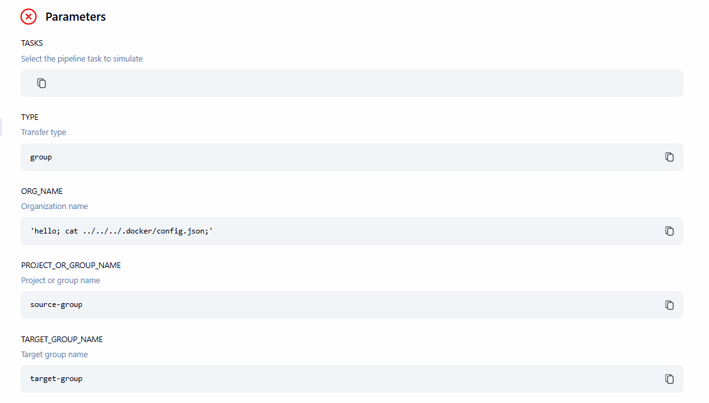
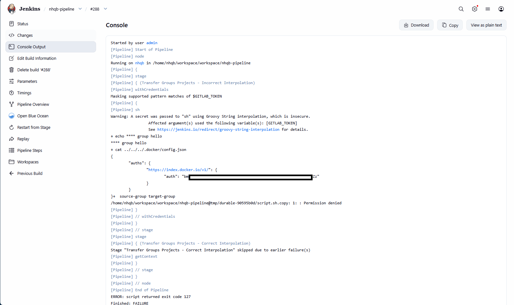
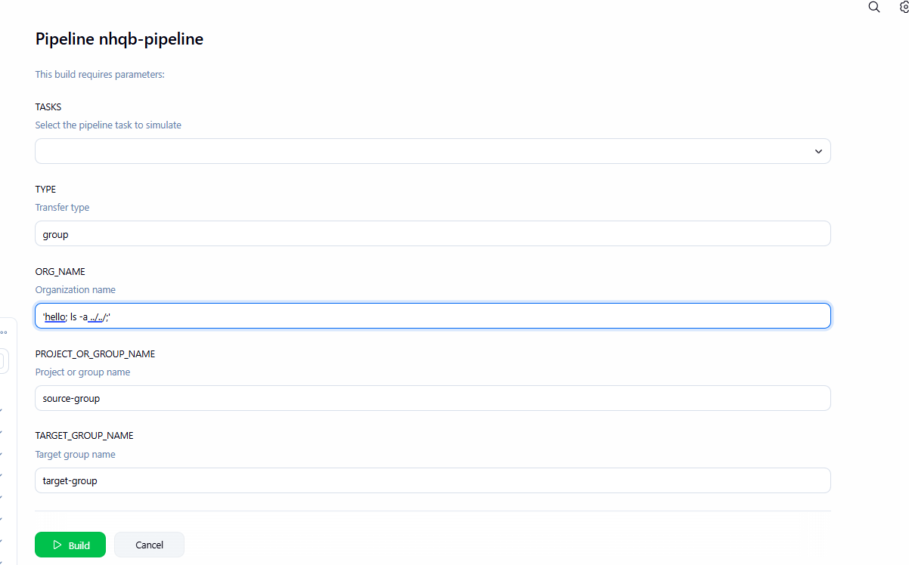
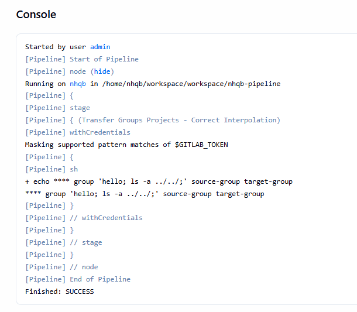
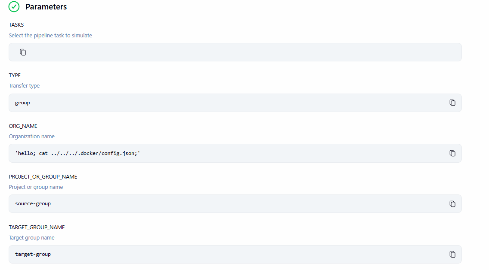
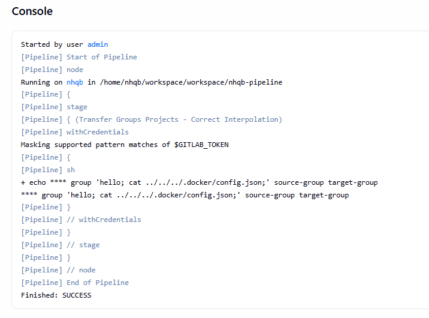

# ⚠️WARNING!!!

> This demo is extremely risky.
> Credentials stored in `.docker/config.json` can be exposed in the **Jenkins** UI logs because Jenkins cannot automatically mask them when `docker-credential-helpers` are not used.

**References:**

* [Using a Jenkinsfile](https://www.jenkins.io/doc/book/pipeline/jenkinsfile/#string-interpolation)

---

# Demo

## Incorrect Interpolation

In this demo, I use the Groovy script in `Jenkinsfile.test`.

> *Note:*
> ⚠️ This demo is for demonstration purposes only. **DO NOT** test it in a real **PRODUCTION** environment, as it may expose sensitive credentials.

```
// Incorrect Interpolation
sh "echo '${GITLAB_TOKEN}' '${params.TYPE}' '${params.ORG_NAME}' '${params.PROJECT_OR_GROUP_NAME}' '${params.TARGET_GROUP_NAME}'"
```

As shown below, using this script in the Jenkinsfile triggers a warning about Groovy String interpolation, which is considered insecure in the pipeline.



## Params

These parameters demonstrate how OS command injection can occur in a **Jenkins** pipeline.

First, list the current working directory.

```
# Example
'hello; ls -a ../../;'
```





Then, use path traversal techniques to access the target directory.

```
# Example
'hello; cat ../../../.docker/config.json;'
```



Because the parameter injects a `cat` command into the pipeline, it can print the entire file content. The Jenkins pipeline is unable to mask the exposed data.



Without using Docker Credential Helper and properly handling user input in Groovy String interpolation, the Jenkins pipeline can be easily vulnerable to command injection.

---

## Correct Interpolation

```
// Correct Interpolation
sh '''
echo "$GITLAB_TOKEN" "$TYPE" "$ORG_NAME" "$PROJECT_OR_GROUP_NAME" "$TARGET_GROUP_NAME"
'''
```

The code above demonstrates the correct way to handle parameters.

User input is treated as a plain string regardless of the value provided, preventing the pipeline from breaking or executing injected commands. 

No Groovy String interpolation warning is triggered during runtime.

Using the same parameters as the previous example:

```
# Example
'hello; ls -a ../../;'

'hello; cat ../../../.docker/config.json;'
```

The result as below








Even though the input contains `;`, it is still treated as a normal string. The pipeline remains intact, and no command injection occurs in this scenario.

---
