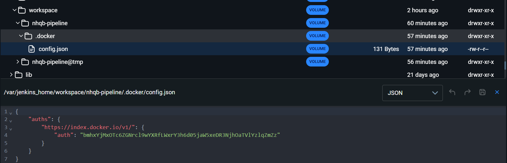
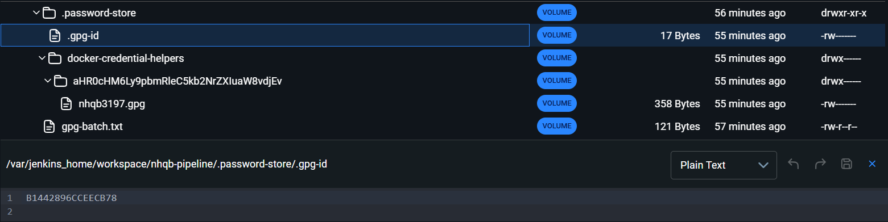
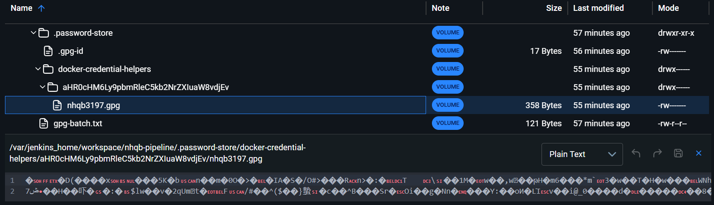

**THIS REPO USE FOR DEMO CONFIG JENKINS WITH CREDENTIALS HELPER**

---

**Setup Jenkins Network + Docker in Docker (This stage use for both stages below)**

```
# Create a Docker network for Jenkins and Docker-in-Docker
docker network create jenkins

docker run --name jenkins-docker --rm --detach `
  --privileged --network jenkins --network-alias docker `
  --env DOCKER_TLS_CERTDIR=/certs `
  --volume jenkins-docker-certs:/certs/client `
  --volume jenkins-data:/var/jenkins_home `
  --publish 2376:2376 `
  docker:dind
```

---

**Setup Jenkins without using credential helper**

* **Build Jenkins Image**

```
# --- # --- # --- # --- # --- # --- # --- # --- # Without credentials helper
# Build
docker build -t myjenkins-blueocean:2.541.3 .

# Run
docker run --name jenkins-blueocean --restart=on-failure --detach `
  --network jenkins --env DOCKER_HOST=tcp://docker:2376 `
  --env DOCKER_CERT_PATH=/certs/client --env DOCKER_TLS_VERIFY=1 `
  --volume jenkins-data:/var/jenkins_home `
  --volume jenkins-docker-certs:/certs/client:ro `
  --publish 8080:8080 --publish 50000:50000 myjenkins-blueocean:2.541.3
```

* **Setup Jenkins**

Access localhost:8080

Default init + installation

Add dockerhub credential

Create pipeline job

* **Jenkinsfile**

For demo purpose, copy the code in Jenkinsfile -> paste in Pipelinescript in Jenkins

Save -> Exec the build

The result

```
Started by user nhqb
[Pipeline] Start of Pipeline
[Pipeline] node
Running on Jenkins in /var/jenkins_home/workspace/nhqb-pipeline
[Pipeline] {
[Pipeline] withEnv
[Pipeline] {
[Pipeline] stage
[Pipeline] { (Test Docker Login CLI)
[Pipeline] withCredentials
Masking supported pattern matches of $DOCKERHUB_USERNAME or $DOCKERHUB_PASSWORD
[Pipeline] {
[Pipeline] sh
+ set +x
Login Succeeded
[Pipeline] sh
+ sleep 120
[Pipeline] sh
+ docker logout
Removing login credentials for https://index.docker.io/v1/
[Pipeline] }
[Pipeline] // withCredentials
[Pipeline] }
[Pipeline] // stage
[Pipeline] stage
[Pipeline] { (Test withCredentials Ops)
[Pipeline] withCredentials
Masking supported pattern matches of $DOCKERHUB_USERNAME or $DOCKERHUB_PASSWORD
[Pipeline] {
[Pipeline] sh
+ set +x

WARNING! Your credentials are stored unencrypted in '/var/jenkins_home/workspace/nhqb-pipeline/.docker/config.json'.
Configure a credential helper to remove this warning. See
https://docs.docker.com/go/credential-store/

Login Succeeded
Hello from Jenkins after Docker Hub login!
Removing login credentials for https://index.docker.io/v1/
[Pipeline] }
[Pipeline] // withCredentials
[Pipeline] }
[Pipeline] // stage
[Pipeline] }
[Pipeline] // withEnv
[Pipeline] }
[Pipeline] // node
[Pipeline] End of Pipeline
Finished: SUCCESS
```

The WARNING is showing that the credentials is stored unencrypted in based 64 which can be easily decrypted.



---

**Set up Jenkins with credential helper**

* **Build Jenkins Image**

```
# --- # --- # --- # --- # --- # --- # --- # --- # With credentials helper
# Build
docker build -f Dockerfile.after -t myjenkins-blueocean:2.541.3-1 .

# Run
docker run --name jenkins-blueocean-1 --restart=on-failure --detach `
  --network jenkins --env DOCKER_HOST=tcp://docker:2376 `
  --env DOCKER_CERT_PATH=/certs/client --env DOCKER_TLS_VERIFY=1 `
  --volume jenkins-data-1:/var/jenkins_home `
  --volume jenkins-docker-certs:/certs/client:ro `
  --publish 8081:8080 --publish 50001:50000 myjenkins-blueocean:2.541.3-1
```

* **Setup Jenkins**

Access localhost:8081

Default init + installation

Add dockerhub credential

Create pipeline job

* **Jenkinsfile.copy**

For demo purpose, copy the code in Jenkinsfile -> paste in Pipelinescript in Jenkins

Save -> Exec the build

```
Started by user nhqb
[Pipeline] Start of Pipeline
[Pipeline] node
Running on Jenkins in /var/jenkins_home/workspace/nhqb-pipeline
[Pipeline] {
[Pipeline] withEnv
[Pipeline] {
[Pipeline] stage
[Pipeline] { (Login 1)
[Pipeline] withCredentials
Masking supported pattern matches of $DOCKERHUB_USERNAME or $DOCKERHUB_PASSWORD
[Pipeline] {
[Pipeline] sh
+ set -eu
+ set +x
/usr/bin/pass
/usr/bin/gpg
/usr/local/bin/docker-credential-pass
Password store initialized for B1442896CCEECB78
docker-credential-helpers/aHR0cHM6Ly9pbmRleC5kb2NrZXIuaW8vdjEv/****: reencrypting to 
Login Succeeded
[Pipeline] }
[Pipeline] // withCredentials
[Pipeline] }
[Pipeline] // stage
[Pipeline] stage
[Pipeline] { (Configure config.json)
[Pipeline] sh
+ set -eu
+ mkdir -p /var/jenkins_home/workspace/nhqb-pipeline/.docker
+ test -f /var/jenkins_home/workspace/nhqb-pipeline/.docker/config.json
+ sed -i 0,/{/s/{/{\n\t"credsStore": "pass",/ /var/jenkins_home/workspace/nhqb-pipeline/.docker/config.json
[Pipeline] }
[Pipeline] // stage
[Pipeline] stage
[Pipeline] { (Logout)
[Pipeline] sh
+ set -eu
+ set +x
Removing login credentials for https://index.docker.io/v1/
[Pipeline] }
[Pipeline] // stage
[Pipeline] stage
[Pipeline] { (Login 2 and Sleep)
[Pipeline] withCredentials
Masking supported pattern matches of $DOCKERHUB_USERNAME or $DOCKERHUB_PASSWORD
[Pipeline] {
[Pipeline] sh
+ set -eu
+ set +x
Login Succeeded
Hello from Jenkins after Docker Hub login!
[Pipeline] }
[Pipeline] // withCredentials
[Pipeline] }
[Pipeline] // stage
[Pipeline] }
[Pipeline] // withEnv
[Pipeline] }
[Pipeline] // node
[Pipeline] End of Pipeline
Finished: SUCCESS
```

Note that no WARNING is in the log. And in workspace, the config.json is:


With this config, it stores credentials in a GPG-encrypted file





---

Ref:

* [docker login | Docker Docs](https://docs.docker.com/reference/cli/docker/login/#credential-helpers)
* [Docker: How to initialize docker-credential-pass - Marc Nuri](https://blog.marcnuri.com/how-to-initialize-docker-credential-pass)
* [Secure your docker login credentials with docker-credential-helpers and ‘pass’ | by Erwan Touba | Medium](https://medium.com/@erwan_84334/secure-your-docker-login-credentials-with-docker-credential-helpers-and-pass-e7a800669e5a)
* [Docker: Setting Up a Credential Helper - DEV Community](https://dev.to/mattdark/docker-setting-up-a-credential-helper-4nbh)
